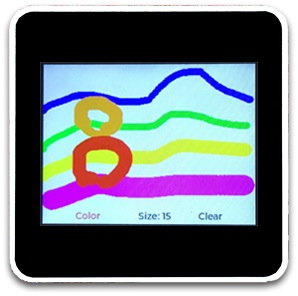

# Drawing Board

Backport the DrawingBoard micropython program provides by UI Flow for the M5Core2 in C with [lvgl 8](https://github.com/lvgl/lvgl).

## Example

Example was provide by `macsbug` on the [M5stack.com forum](https://forum.m5stack.com/topic/3613/how-to-run-lvgl-on-m5stack/26)

Thanks to [@erich74](https://github.com/erich74) for helping.
